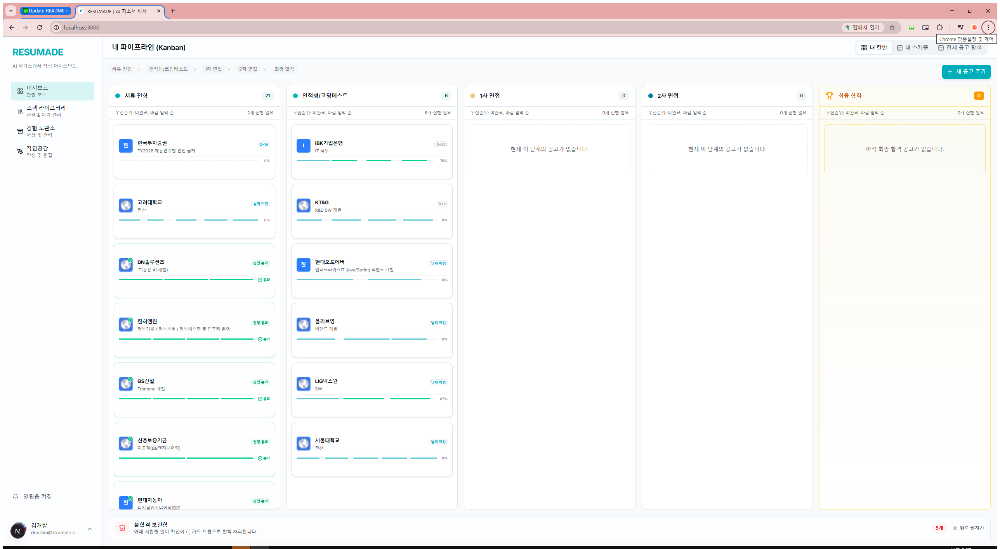
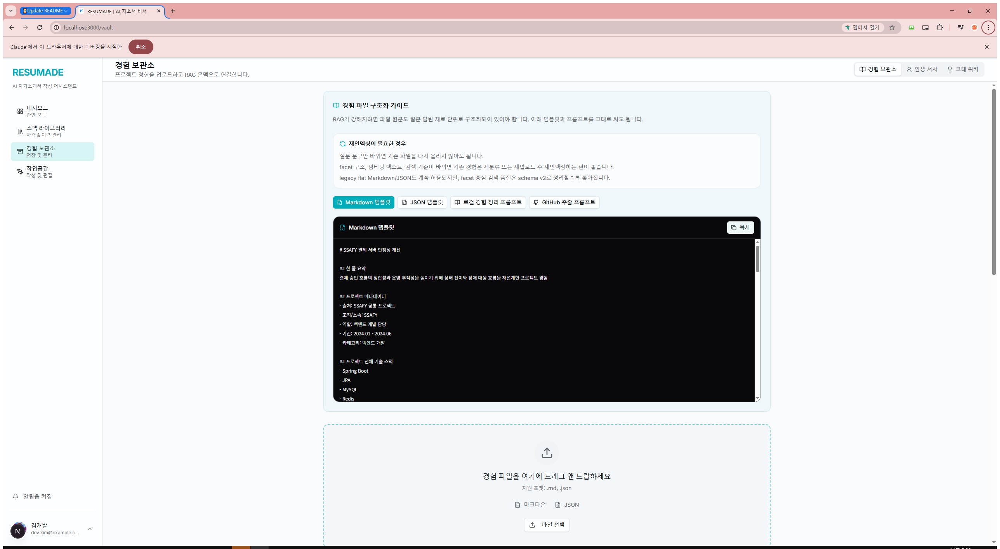

# RESUMADE

RESUMADE는 구직자를 위한 AI 기반 자기소개서 작성 어시스턴트이자 채용 파이프라인 관리 서비스입니다.  
단순 생성형 글쓰기 도구가 아니라, 사용자의 실제 경험 데이터를 바탕으로 문항에 맞는 초안을 만들고, 번역-세탁-검수 파이프라인을 거쳐 더 자연스럽고 사람다운 문장으로 다듬는 것을 목표로 합니다.

## 핵심 기능

### 1. 채용 대시보드

- 지원 공고를 칸반 보드 형태로 관리
- 서류, 인적성/코딩테스트, 1차 면접, 2차 면접, 최종 합격 단계 추적
- 카드 클릭 시 상세 패널에서 JD, AI 인사이트, 자소서 문항 확인

### 2. 경험 보관소

- `.md`, `.json` 기반 경험 데이터 업로드
- 업로드한 경험을 카드 단위로 분류하고 관리
- 자소서 문항과 관련 높은 경험을 검색해 RAG 컨텍스트로 활용

### 3. 자소서 작업실

- 문항별 초안 생성
- 번역 기반 wash 단계와 patch 검수 단계 수행
- 오역, 표현 부자연스러움, 수정 제안을 비교하면서 최종 문장 다듬기
- SSE 기반 진행 상태 스트리밍 지원

## 제품 방향

- 기계적인 생성문이 아닌 human patch 중심의 작성 흐름
- 검증된 경험 데이터 재사용을 위한 RAG 기반 컨텍스트 주입
- 실제 취업 준비 흐름에 맞춘 파이프라인 관리 UX
- 장시간 AI 작업에도 끊기지 않는 스트리밍 중심 인터페이스
- 여백과 가독성을 중시한 텍스트 중심 UI

## 기술 스택

### Frontend

- Next.js 16 App Router
- React 19
- TypeScript
- Tailwind CSS 4
- shadcn/ui
- Radix UI
- Zustand
- SSE client utility

### Backend

- Spring Boot 3.4
- Java 21
- Spring Web
- Spring Data JPA
- MySQL
- Elasticsearch
- Redis
- LangChain4j
- Tess4J OCR

## 현재 구현 화면

- `/`
  채용 파이프라인 칸반 보드
- `/vault`
  경험 업로드 및 경험 카드 관리 화면
- `/workspace`
  작업할 공고를 고르는 작업실 진입 화면
- `/workspace/[id]`
  컨텍스트 패널과 번역/검수 패널이 나뉜 작업 화면
- `/settings`
  사용자 설정 화면

## Human Patch 파이프라인

작업실은 긴 AI 처리 시간을 사용자에게 그대로 숨기지 않고, SSE로 단계별 진행 상황을 보여주는 구조로 설계되어 있습니다.

1. RAG 컨텍스트 조회
2. 초안 생성
3. Wash 번역 단계
4. Patch 검수 단계
5. 완료 결과 및 오역 피드백 반영

관련 구현 위치:

- Frontend: `Frontend/lib/store/workspace-store.ts`
- Frontend: `Frontend/lib/network/stream-sse.ts`
- Backend: `Backend/src/main/java/com/resumade/api/workspace/controller/WorkspaceController.java`

## 프로젝트 구조

```text
Resumade/
|-- Backend/      # Spring Boot API, AI 파이프라인, DB, SSE
|-- Frontend/     # Next.js App Router UI
|-- Infra/        # 인프라 관련 리소스
|-- TestData/     # 테스트용 데이터 및 샘플 자산
`-- .env.example
```

## 실행 방법

### 1. 환경 변수 설정

루트의 `.env.example`을 복사해 `.env`를 만들고 값을 채웁니다.

```env
OPENAI_API_KEY=
OPENAI_API_TIMEOUT=PT5M
GEMINI_API_KEY=
GEMINI_API_URL=https://generativelanguage.googleapis.com/v1beta
GOOGLE_CLOUD_TRANSLATE_API_KEY=
DEEPL_API_KEY=
MYSQL_USERNAME=resumade_user
MYSQL_PASSWORD=resumade_password
TRANSLATION_PROVIDER=google-cloud
TRANSLATION_FALLBACK_PROVIDER=deepl
```

### 2. 백엔드 실행

```powershell
cd Backend
.\gradlew.bat bootRun
```

### 3. 프론트엔드 실행

```powershell
cd Frontend
npm install
npm run dev
```

## 빌드 검증

백엔드:

```powershell
cd Backend
.\gradlew.bat compileJava
```

프론트엔드:

```powershell
cd Frontend
npm run build
```

## 주요 API 영역

현재 백엔드는 다음 컨트롤러를 중심으로 구성되어 있습니다.

- `HealthCheckController`
- `ExperienceController`
- `ApplicationController`
- `WorkspaceController`

## README에 스크린샷 넣기

가능합니다. README에는 실제 서비스 화면 이미지를 바로 넣을 수 있고, 이 채팅에서도 같은 이미지를 따로 보여드릴 수 있습니다.

추천 방식:

1. 대시보드, 경험 보관소, 작업실 화면을 캡처
2. `docs/images/` 폴더에 저장
3. `README.md`에서 Markdown 이미지로 삽입

예시:

```md



```

## 현재 상태

이 저장소에는 이미 대시보드, 경험 보관소, 작업실의 핵심 UI 골격과 human patch용 SSE 백엔드 기반이 들어가 있습니다.  
다음 단계에서는 실제 서비스 스크린샷, 아키텍처 다이어그램, 배포 방법, API 예시를 붙여 README를 더 완성도 있게 확장할 수 있습니다.
